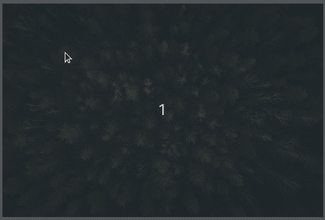

# react-image-hotspot
This is a small library providing functionality to create hotspots on an image.


## Installation
```
yarn add react-image-hotspot
```

## Getting started
Simply import and use the `ImgaeHotspot` component
```jsx
import { ImageHotspot } from 'react-image-hotspot';

const App = () => {
  const [value, setValue] = React.useState([]);

  return (
    <ImageHotspot
      src="https://...image"
      value={value}
      onChange={setValue}
    />
  );
}
```